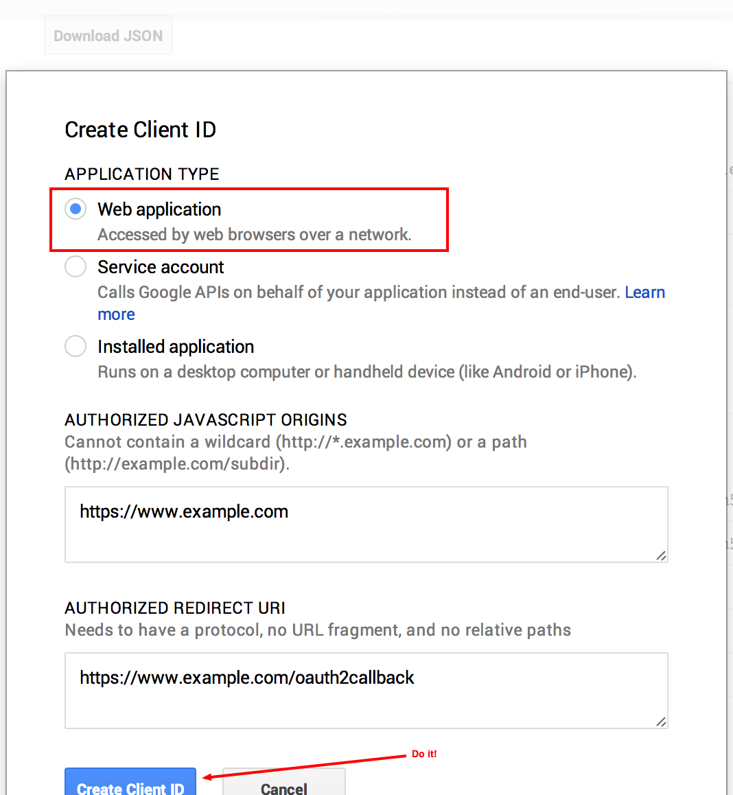

============
Installation
============

Install Tarbell with `pip install tarbell`
------------------------------------------

::

    pip install -e git+https://github.com/newsapps/flask-tarbell@0.9-beta5#egg=tarbell

.. note::

    0.9-beta5 is the current development version. It should only be used by advanced users because
    it may be unstable. If you are using this version, you'll need to run
    ``pip install -U -e git+https://github.com/newsapps/flask-tarbell@0.9-beta5#egg=tarbell`` from
    time to time to pick up the latest changes.

A note on virtualenvs
---------------------

.. note::
 
  If you've never heard of virtualenvs or know you're not using one with
  Tarbell, skip this section.

Virtual environments (`virtualenv <http://www.virtualenv.org/>`_) are useful for
developers and advanced users managing many Python packages. Tarbell can be installed
globally or within a virtualenv.

If you'll be working on Tarbell itself, extending its functionality
or otherwise manipulating the guts of the system, then it might make sense to
install it inside a virtualenv.

Here are some things to keep in mind if you use a virtualenv:

* The Tarbell settings file `(~/.tarbell/settings.yaml)` is global, meaning all
  Tarbell projects - whether inside a virtualenv or not - share the same
  settings. This includes the path that Tarbell expects to find all your
  projects (i.e., where Tarbell will look when you run `tarbell list` and
  `tarbell switch`.)
* The `client_secrets.json` file used to authenticate to Google is also global,
  so you may run into problems using multiple Google accounts to access spreadsheets.

Configure Tarbell with `tarbell configure`
------------------------------------------

The `tarbell configure` command will set up your Tarbell settings::

  tarbell configure

Please consider setting up Google spreadsheet access for collaborative data editing and Amazon
S3 settings for easy publishing.

Configure Google spreadsheet access (optional)
----------------------------------------------

In order to allow Tarbell to create new Google Spreadsheets, you'll need to
download a `client_secrets.json file <https://developers.google.com/api-client-library/python/guide/aaa_client_secrets>`_
to access the Google Drive API. You can share this file with collaborators and
within your organization, but do not share this file anywhere public.

Log in to the `Google API Developer Console <https://cloud.google.com/console/project>`_ and create a new project:

.. image:: create_1_new.png

.. image:: create_1-5_new.png
   :width: 700px

Now click the "APIs & auth" tab. (Click on the "APIs" tab below that if it 
doesn't open automatically.) Enable Google Drive API.

.. image:: create_2_new.png
   :width: 700px

You'll also want to ensure that BigQuery API, Google Cloud SQL, Google Cloud 
Storage and Google Cloud Storage JSON API are enabled. (They should be by default, 
but things will break if they aren't.)

.. image:: create_2-5_new.png
   :width: 700px

Click the "Credentials" tab (right below "APIs") to create a client ID:

.. image:: create_3_new.png
   :width: 700px

This is the important screen. Select "web app":

Whew! Now you can download the ``client_secrets.json`` file:

.. image:: create_6_new.png
   :width: 700px

The file you download will be called something like 
`client_secret_longstringofrandomlettersandnumbers.apps.googleusercontent.json`.

Rename it to `client_secrets.json`.

Now, you do one of the following:

* Copy `client_secrets.json` to `~/.tarbell/client_secrets.json`
* Specify the `client_secret.json` download location when running `tarbell configure`. (Tarbell should be able to figure out where the file is automatically when you configure it.)

The first time a Tarbell command needs access to a Google spreadsheet (say, while you're running `tarbell configure`), you'll be prompted to
authenticate::

  Go to the following link in your browser:

      https://accounts.google.com/o/oauth2/auth?scope=https%3A%2F%2Fwww.googleapis.com%2Fauth%2Fdrive&redirect_uri=urn%3Aietf%3Awg%3Aoauth%3A2.0%3Aoob&response_type=code&client_id=705475625983-bdm46bacl3v8hlt4dd9ufvgsmgg3jrug.apps.googleusercontent.com&access_type=offline

  Enter verification code: 

Follow the link:

You should receive a confirmation code:

.. image:: create_8.png

Enter it. If it works, you'll see:

  Authentication successful.

Now you can access and create Google spreadsheets to use with Tarbell projects.

Configure Amazon S3
-------------------

Generate keys for your Amazon S3 account. Add them during the Amazon S3 section of installation.

To generate keys, log into your `AWS Console <http://aws.amazon.com/>`_, click your name and select
"Security Credentials".

.. image:: aws_security_creds.png
   :width: 700px

Don't worry about IAM users right now.

You should see a list of different sections. Click the section that reads, 
"Access Keys (Access Key ID and Secret Access Key)" and then the button, "Create New Access Key."
Note that if you have existing keys, you can currently retrieve its Access Key ID 
and Secret Access Key from the legacy Security Credentials page (linked to in this section), 
but that Amazon plans to remove the ability to see this information soon.

.. image:: aws_create_new_key.png
   :width: 700px

Woohoo, now you can download your keys! You MUST do this now -- Amazon only lets you download 
the keys on this screen. If you accidentally close the prompt, you can always delete the 
keys you just generated and generate a new pair.

.. image:: aws_download_keys.png
   :width: 700px

Now you need to tell Tarbell what your AWS keys are. Run `tarbell configure`. After it checks to see if Google is configured, you'll get this prompt::

  Would you like to set up Amazon S3? [Y/n] y

  Please enter your default Amazon Access Key ID: (leave blank to skip)

  Please enter your default Amazon Secret Access Key: (leave blank to skip)

  What is your default staging bucket? (e.g. apps.beta.myorg.com, leave blank to skip)

If you don't already have a staging or production bucket, you can create one by 
going to the S3 management console and clicking "Create bucket."

.. image:: aws_create_bukkits.png
   :width: 700px

.. image:: aws_bukkit_settings.png
   :width: 700px

Just remember that when you name a bucket, it must be unique to AWS, not just your account. 
Like usernames, bucket names are shared across the entire Amazon system. (Which is silly, but 
that's how it is.)

.. image:: aws_bukkit_settings.png
   :width: 700px

Once you've added production and staging buckets to your configuration, you will get this message::

  Would you like to add bucket credentials? [y/N]

If there are additional buckets in your S3 account that you want to use with Tarbell, enter
their names here. Otherwise, skip this.

Set a default project path
--------------------------

This is where your Tarbell projects will live. This path will be used by `tarbell list` 
and `tarbell switch`.

.. image:: project_path.png
   :width: 700px

We're set! Let's start building awesome sites!
