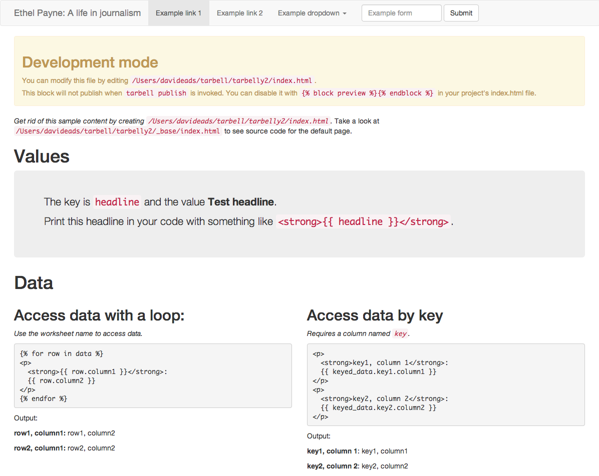

================
Tarbell tutorial
================

Let's build a website about celebrated Chicago journalist Ethel Payne! 

Install Tarbell
---------------

First you need Tarbell. Fair warning, you're going to have to run these commands in
a terminal::

    pip install tarbell==0.9b1

(Don't know how to install pip? <resource-tk> can help!)

Configure Tarbell
-----------------

Got it? Now configure Tarbell::

    tarbell configure

For our tutorial, say no to configuring Amazon and Google docs. It's optional!::

  Configuring Tarbell. Press ctrl-c to bail out!

  Would you like to create a Tarbell configuration in /Users/davideads/.tarbell? [Y/n] Y

  Would you like to use Google spreadsheets [Y/n]? n
  No worries! Don't forget you'll need to configure your context variables in each project's config.py file.

  - Done configuring Google spreadsheets.

  Would you like to set up Amazon S3? [Y/n] n

  - Not configuring Amazon S3.

  What is your Tarbell projects path? [Default: /Users/davideads/tarbell, 'none' to skip] 

  Directory exists!

  Projects path is /Users/davideads/tarbell

  - Done setting up projects path.
  + Adding Basic Bootstrap 3 template (https://github.com/newsapps/tarbell-template)
  + Adding Searchable map template (https://github.com/eads/tarbell-map-template)

  - Done configuring project templates.

  Creating /Users/davideads/.tarbell/settings.yaml

  - Done configuring Tarbell. Type `tarbell` for help.

Create a new project
--------------------

Now that you've got Tarbell configured, create a new project::

  tarbell newproject

You'll need to answer a few questions::

  tarbell newproject

  What is the project's short directory name? (e.g. my_project) ethelpayne

  Where would you like to create this project? [/Users/davideads/tarbell/ethelpayne] 

  What is the project's full title? (e.g. My awesome project) Ethel Payne: A life in journalism

  Pick a template

    [1] Basic Bootstrap 3 template
        https://github.com/newsapps/tarbell-template

    [2] Searchable map template   
        https://github.com/eads/tarbell-map-template

  Which template would you like to use? [1] 1

  - Cloning https://github.com/newsapps/tarbell-template to /Users/davideads/tarbell/ethelpayne

  Copying configuration file
  Copying _base/_spreadsheet.xlsx to tarbell.py's DEFAULT_CONTEXT

  - Creating tarbell.py project configuration file

  - Done copying configuration file

  Setting up git remote repositories

  - Renaming master to update_project_template

  - Add and commit tarbell.py

  What is the URL of your project repository? (e.g. git@github.com:eads/myproject.git, leave blank to skip) 

  - Not setting up remote repository. Use your own version control!

  All done! To preview your new project, type:

  tarbell switch ethelpayne

  You got this!

Previewing your project locally
-------------------------------

Well, you heard the machine, you got this. Run the switch command to fire up a preview server::

  tarbell switch ethelpayne

::

  Switching to ethelpayne
  Edit this project's templates at /Users/davideads/tarbell/ethelpayne
  Running preview server...

  Press ctrl-c to stop the server
   * Running on http://127.0.0.1:5000/
   * Restarting with reloader

Now visit http://127.0.0.1:5000/ in a browser.

Add some context variables
--------------------------

First, set some project data in `/path/to/project/tarbell_config.py` (in this case `/Users/davideads/tarbell/ethelpayne/tarbell_config.py`). 
Open the file in your favorite editor. It should look like this::

  # -*- coding: utf-8 -*-

  """
  Tarbell project configuration
  """

  # Short project name
  NAME = "ethelpayne"

  # Descriptive title of project
  TITLE = "Ethel Payne: A life in journalism"

  # Google spreadsheet key
  #SPREADSHEET_KEY = "None"

  # Create JSON data at ./data.json, disabled by default
  # CREATE_JSON = True

  # S3 bucket configuration
  S3_BUCKETS = {
      # Provide target -> s3 url pairs, such as:
      # "mytarget": "s3://mys3url.bucket.url/some/path"
      "staging": "s3://projects.beta.coolorg.net/tarbelly2/",
      "production": "s3://projects.coolorg.net/tarbelly2/",
  }

  # Repository this project is based on (used for updates)
  TEMPLATE_REPO_URL = "https://github.com/newsapps/tarbell-template"

  # Default template variables
  DEFAULT_CONTEXT = {
      'data': [   {   'column1': u'row1, column1',
                      'column2': u'row1, column2'},
                  {   'column1': u'row2, column1',
                      'column2': u'row2, column2'}],
      'google_analytics_id': None,
      'headline': u'Test headline',
      'keyed_data': {   'key1': {   'column1': u'key1, column1',
                                    'column2': u'key1, column2',
                                    'key': u'key1'},
                        'key2': {   'column1': u'key2, column1',
                                    'column2': u'key2, column2',
                                    'key': u'key2'}},
      'name': u'ethelpayne',
      'opengraph_description': None,
      'opengraph_image': None,
      'title': u'Ethel Payne: A life in journalism',
      'twitter_description': None
  }
 
Edit the last section to include a new variable::

  DEFAULT_CONTEXT = {
      # ...
      'title': u'Ethel Payne: A life in journalism',
      'twitter_description': None,
      'quote': u'I stick to my firm, unshakeable belief that the black press is an advocacy press, and that I, as a part of that press, can’t afford the luxury of being unbiased ... when it come to issues that really affect my people, and I plead guilty, because I think that I am an instrument of change.',
      'quote_author': u'Ethel Payne',
  }

Now copy `_base/index.html` to your project's root directory. It should look like::

  

  
  

    
<em>Get rid of this sample content by creating <code>{{ PROJECT_PATH }}/{{ PATH }}</code>.</em> Take a look at <code>{{ PROJECT_PATH }}/_base/index.html</code> to see source code for the default page.

    
    <h1>Values</h1>

    

      
The key is <code>headline</code> and the value <strong>{{ headline }}</strong>.

      
Print this headline in your code with something like <code>{{ "<strong>{{ headline }}</strong>" }}</code>.
    

    <h1>Data</h1>

  

    

      <h2>Access data with a loop:</h2>
      
<em>Use the worksheet name to access data.</em>

  <pre>
  {{ "" }}
  {{ "
" }}
  {{ "  <strong>{{ row.column1 }}</strong>:" }}
  {{ "  {{ row.column2 }}" }}
  {{ "
" }}
  {{ "" }}
  </pre>

      
Output:

      
      

        <strong>{{ row.column1 }}:</strong>
        {{ row.column2 }}
      

      
    

    

      <h2>Access data by key</h2>
      
<em>Requires a column named <code>key</code>.</em>

  <pre>
  {{ "
" }}
  {{ "  <strong>key1, column 1</strong>:" }} 
  {{ "  {{ keyed_data.key1.column1 }}" }}
  {{ "
" }}
  {{ "
" }}
  {{ "  <strong>key2, column 2</strong>:" }} 
  {{ "  {{ keyed_data.key2.column2 }}" }}
  {{ "
" }}
  </pre>

      
Output:

      

        <strong>key1, column 1</strong>:
        {{ keyed_data.key1.column1 }}
      

      

        <strong>key2, column 2</strong>:
        {{ keyed_data.key2.column2 }}

    

  

  

Let's put your quote right at the top. Add a snippet right after `
`::

    
    

      {# Ethel Payne quote #}
      

        <h2>"{{ quote }}"</h2>
        <small>{{ quote_author }}</small>
      

      {# ... #}

    

    

Reload the server at http://127.0.0.1:5000 in your web browser to see your changes!

.. image:: preview2.png
   :width: 700px

Building a page
---------------

The default `index.html` sure has a lot of stuff in it. Let's replace it with a simplified version::

  

  
  

    {# All your content, Bootstrap columns... #}
  

  

  
  {{ super() }} {# Calls base css block to include Bootstrap and base css #}
  
  

  
  {{ super() }} {# Calls base scripts block to include jQuery and Bootstrap #}
  
  

There are a couple of key points to note in this simple template...

- This is a Jinja template -- you can do anything that Jinja templates can do. `Learn more about Jinja <http://jinja.pocoo.org/docs/>`_.
- The template extends the template defined in `_base/_base.html`. All files in `_base` are available as if they were on the project root. Base templates provide a way to keep boilerplate code to a minimum. Build a base template for your team or organization 
- The base template defines *blocks* to be customized.
- Comments can use Jinja syntax (`{# ... #}`)
- To get the default block behavior *and* extend a block, use `{{ super() }}`.

Now start editing the content block and scripts blocks. We're just doing some silly stuff here to show off how you can start using DEFAULT_CONTEXT and some of the common blocks::

  

  
  

    <table class="table">
      <tbody>
        
        <tr>
          <td>{{ row.column1 }}</td>
          <td>{{ row.column2 }}</td>
        </tr>
        
      </tbdoy>
    </table>
  

  

  
  {{ super() }} {# Calls base css block to include Bootstrap and base css #}
  
  

  
  {{ super() }} {# Calls base scripts block to include jQuery and Bootstrap #}
  
  
  

Customizing page elements
-------------------------

You'll notice there's a nav bar at the top of the page. Instead of overriding a block, complex elements like the nav can be included in the base template as template snippets. In `_base` you'll see a file called `_nav.html`. Copy that file to your root directory and start editing. Your version of the `_nav.html` will take precedence over the version defined in `_base.html`.
