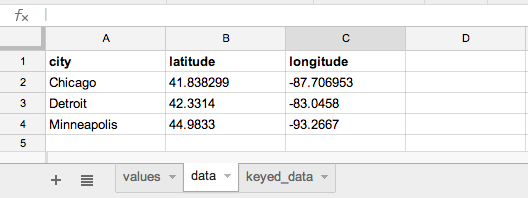

================
Tutorial
================

Let's build a website about celebrated Chicago journalist Ethel Payne!

You'll need to have access to a command prompt (an application on your computer
that allows you to execute text-based commands). Search for the Terminal application.
All of the commands we'll show you here will need to be typed into the command prompt.

First you need to `install <install.html>`_ and `configure <install.html#configure-tarbell-with-tarbell-configure>`_
Tarbell. (Make sure to set up a Google spreadsheet.) Go ahead. We'll wait.

.. note::

  Tarbell currently does not work on Windows machines.

Set up a new project
====================

Once Tarbell is configured, create a new project by typing this command into your prompt::

  tarbell newproject

You'll need to answer a few questions. What will its name be, where on your computer will it live? And a few others about its data sources and management. Anytme you see something in brackets, you are being prompted with a default answer, and can just hit enter if you wish to accept it. The process will go something like this::

  tarbell newproject

  What is the project's short directory name? (e.g. my_project) ethelpayne

  Where would you like to create this project? [/Users/davideads/tarbell/ethelpayne] 

  What is the project's full title? (e.g. My awesome project) Ethel Payne: A life in journalism

You will be asked to choose which base template you wish to be the foundation of your project. base templates can be expanded upon but are very useful for setting the basic configurations necessary for the kinds of projects they have been designed for. See `this page <http://flask.pocoo.org/docs/base templates/>`_ for more about base templates, and go ahead and pick one::
  
  Pick a Tarbell base template

    [1] Basic Bootstrap 3 template
        https://github.com/newsapps/tarbell-template

  [2] Searchable map template   
        https://github.com/eads/tarbell-map-template

  Which template would you like to use? [1] 1

  Cloning into '_blueprint'...

  Checking connectivity... done

At this point Tarbell will prompt you to make a Google spreadsheet, and if you didn't do this during the `install <install.html>`_ and `configure <install.html#configure-tarbell-with-tarbell-configure>`_ part of the tutorial, it's a good idea to do it now. Tarbell will look for the Google settings you'll need::

  client_secrets found. Would you like to create a Google spreadsheet? [Y/n] y

  What Google account should have access to this this spreadsheet? (Use a full email address, such as your.name@gmail.com or the Google account equivalent.)

  Success! View the spreadsheet at https://docs.google.com/spreadsheet/your_key_will_go_here

Now Tarbell installs your project's files and creates a git repo for your code::

  Copying configuration file

  - Creating tarbell.py project configuration file

  - Done copying configuration file

  Copying html files...
  Copying index.html to /Users/davideads/tarbell/ethelpayne

  Initial commit

  [master (root-commit) 2bf96fb] Created ethelpayne from https://github.com/newsapps/tarbell-template
  5 files changed, 58 insertions(+)
  create mode 100644 .gitignore
  create mode 100644 .gitmodules
  create mode 160000 _blueprint
  create mode 100644 index.html
  create mode 100644 tarbell_config.py

At this point you might have the option to work with some project management tools, and you will definitely be prompted to use Github for sharing your code::  

  -- Calling newproject hooks --
  --- Calling create_repo
  Want to create a Github repo for this project [Y/n]? n
  Not creating Github repo...

  All done! To preview your new project, type:

  tarbell switch ethelpayne

  or

  cd /Users/davideads/tarbell/ethelpayne
  tarbell serve

And if all has gone well? You will see this message::

  You got this!

Well, you heard the machine, you got this. Run the switch command to fire up a preview server::

  tarbell switch ethelpayne

::

  Switching to ethelpayne
  Edit this project's templates at /Users/davideads/tarbell/ethelpayne
  Running preview server...

  Press ctrl-c to stop the server
   * Running on http://127.0.0.1:5000/
   * Restarting with reloader

Now visit http://127.0.0.1:5000/ in a browser.

You can also run your project by changing to the proejct directory and running the command:: 
  
    tarbell serve.
  
You're ready to start editing your template.

Structure your project
======================
It's a good idea to organize your project's files according to convention. That way everyone knows 
where to find things. Make directories named css, data, images and js in your project root directory (i.e., not in _blueprint) 
to keep your project uncluttered. See the section for `creating and installing projects <create.html>`_ for 
more detail about best practices when creating your projects.

Add content
===========

In a browser, open the Google spreadsheet that you created during the project set up.
This is where our website's content will live. Let's look at the values worksheet (visible in
the tabs in the bottom left) first.
You should see something like this:

.. image:: values_worksheet.png

Keys and values are a common idea in programming: each key is shorthand for a corresponding value.
Each of the values in the *values* column is available to your site when you use
the matching *key* in your template.

.. note::

  Header fields that start with underscores, like *_notes* does here, will not be made
  available to your template.

Open your project's index.html page and, assuming you chose the Basic Boostrap template (option 1),
you should be able to find this line

.. code-block:: django

    <h1>{{ headline }}</h1>

.. note::

  To start creating pages, you'll need a text editor. (`TextWrangler <http://www.barebones.com/products/textwrangler/>`_ 
  is a decent option.)

Look at your page in the browser again and notice the headline matches what's
in your Google spreadsheet under the *value* column with the *key* "headline".
Try changing that value in the spreadsheet to "Ethel Payne, Chicago journalist".

Reload the server at http://127.0.0.1:5000 in your web browser to see your changes!

You can add as many keys and values as you like. We'll add a few.

.. image:: addtl_values.png

Now we need to reference these variables in the template. Go back to index.html and add

.. code-block:: django

  <blockquote>{{ quote }}</blockquote>
  
from {{ quote_source }}

Reload your site and look at the results!

.. note::

  Tarbell uses `Jinja2 <http://jinja.pocoo.org/>`_ for templating. Read the `excellent documentation <http://jinja.pocoo.org/docs/>`_ to learn more about using Jinja.

Displaying data
===============

Sometimes you need to display structured data. Helpfully, the Google spreadsheet you
created has some data like this under the *data* worksheet. The best way to display
this data in Tarbell is by using a for loop (using `Jinja2 <http://jinja.pocoo.org/>`_ syntax)

.. code-block:: django

  
    

      <strong>{{ row.column1 }}:</strong>
      {{ row.column2 }}
    

  

You should see the following when you reload your page:

**row1, column1**:	row1, column2
**row2, column1**:	row2, column2

Let's take a closer look at what's going on here:

.. code-block:: django

  

This reads in every row in the *data* worksheet. If we called our worksheet "birthdates,"
we could access that data by doing:

.. code-block:: django

  

You'll notice that we no longer have columns labeled "key" and "value." Instead, we access
the column we want by name. To understand this better, let's add some data about some
famous ladies who might have been friends of Ida Tarbell had they known one another:

Now let's edit our index.html again to display this information:

.. code-block:: django

  
    <h2>{{ row.name }}</h2>
    <strong>{{ row.born|format_date }} - {{ row.died|format_date }}</strong>
    
{{ row.name }} was known for her work in {{ row.known_for }}.

  

Your page should now look like this:

Adding CSS
==========

Out of the box, Tarbell gives you Bootstrap 3 CSS. Chances are, you'll want to extend
this to add your own CSS to your project.

To this point, we've ignored the ``_blueprint`` directory in your project. Now's the time to
dive in! You may have noticed this line up at the top of your ``index.html`` file:

.. code-block:: django

  

The ``_base.html`` file is where all of the CSS, JavaScript and other goodies live. By "extending"
``_base.html``, index.html has access to all of the things that live in the blueprint. You can
`read more about how template inheritance works here. <http://jinja.pocoo.org/docs/templates/#template-inheritance>`_

.. note::

  Filenames prefaced with an underscore will be ignored when you publish your project. Our naming convention
  is to use underscores for "partial" templates that represent small pieces of the page, like navigation
  and footers.

There are two CSS blocks at the top of the page:

.. code-block:: django

  
  <link rel="stylesheet" type="text/css" href="http://cdnjs.cloudflare.com/ajax/libs/twitter-bootstrap/3.1.1/css/bootstrap.min.css" />
  <link rel="stylesheet" type="text/css" href="css/base.css" />
  

  

The first block includes Bootstrap 3's CSS and your project's default base.css stylesheet. Don't worry about
it right now. The second block is what you'll want to extend.

.. note::

  You'll only need to touch the library_css block if you need to do something like override the version of Bootstrap
  included here. Otherwise, for adding project-wide styles, edit the base.css file.

In your project root (i.e., not in _blueprint), create a css folder, if you haven't done so already. Inside that, create a new style.css file and
add some CSS rules:

.. code-block:: css

  h2 { font-family: Georgia, serif; }
  strong { color: #c7254e; }

Now switch back over to your index.html and add the css block. Do this on line 2, after the base extension:

.. code-block:: django

  

  
  <link rel="stylesheet" href="css/style.css">
  

  

Your text should now be styled!

Using Javascript
================

You can include JavaScript on your page much the way you would include CSS. By default,
these are the blocks available in _base.html:

.. code-block:: django

  
  
  
  

  

The *library_scripts* block contains the default Bootstrap Javascript and jQuery. You probably
don't need to mess with this.

The *scripts* block can be extended in your templates. You'll want to create a *js* directory in
your project root to hold all of your Javascript files. Then you can include them in your index.html
(or other templates):

.. code-block:: django

  
  
  

Using ``{{ super() }}``
=======================

Sometimes, you want to extend a CSS or Javascript block without overriding the stuff that's in the
base. You can do that with the ``super()`` template tag. This will look at all of the things in the
base version of the block, and add your new content to it rather than override it. For instance:

.. code-block:: django

  
  {{ super() }}
  
  

This will yield this on the rendered page:

.. code-block:: html

  
  
  

Without ``super()``, you would merely end up with:

.. code-block:: html

  

Overriding default templates
============================

While the Tarbell base template (`see more on base templates <http://tarbell.readthedocs.org/en/0.9-beta5/build.html>`_) 
contains some very handy things, you may find you need to override some of the provided templates. One of 
the most common cases in which this occurs is the navigation.

In the ``_blueprint/base.html`` template, you can see that the nav is included just before the content starts:

.. code-block:: django

  
    
  

  

To override the default nav, create a new ``_nav.html`` file in your project root (at the same
level as ``index.html``, not within the ``_blueprint`` directory). Type in a message to yourself:

.. code-block:: django

  Ida Tarbell would be proud of this website!

Reload your test page. Bingo!

Now, such a message probably isn't very helpful to your users, so to create a more functional
nav, copy the code out of ``_blueprint/nav.html``, paste it into ``_nav.html``,
and rejigger the code as desired. It's all Bootstrap 3, so you might find it helpful to
`view the Bootstrap navbar docs <http://getbootstrap.com/components/#navbar>`_.

Putting it all together: Leaflet maps
=====================================

With Tarbell, you can use a Google spreadsheet to provide any kind of data to your page: text, image URLs, and 
even latitude/longitude data that can power a map. We're going to show you how to use Tarbell to store
geodata for a map.

Set up the spreadsheet
^^^^^^^^^^^^^^^^^^^^^^

First, we need to create that Google spreadsheet to power the map. Go to the spreadsheet you created when you started
your project, and edit the ``data`` tab to contain columns named ``city``, ``latitude`` and ``longitude``.
Then, select the visible cells with your mouse, and choose Format -> Number -> Plain text.
(This will prevent Google from automatically converting your lat/longs to dates.)
Enter the following data:

*Chicago 41.838299 -87.706953*
*Detroit 42.3314 -83.0458*
*Minneapolis	44.9833	-93.2667*

It should look like this:

Make a holder for the map
^^^^^^^^^^^^^^^^^^^^^^^^^

Now, we're going to create what's called a "partial." This is an HTML file which gets parsed and
added to another HTML file when Tarbell compiles your pages. (``_nav.html`` is a partial,
as is ``_footer.html``.) We'll call it ``_map.html``. Open it up and add a div that will
contain your map::

    

.. note::
  Partials are always prefaced with an underscore ``_``. This tells Tarbell to refrain from
  compiling them as independent pages. Otherwise, your project would end up with pages like
  `yoursite.com/footer.html`. Anything you write in a partial could also be written directly on
  a page, but using a partial makes it easier to reuse code. For instance, we may want to use our map on
  every page on our site, but using a partial means we only store the code in one file, making it
  easy to update and maintain.

Give the map a height
^^^^^^^^^^^^^^^^^^^^^

We'll need to set a height and width for this map in the ``style.css`` CSS file created earlier with the following rule::

  #map { height: 600px; width: 600px; }

Include map assets on the index page
^^^^^^^^^^^^^^^^^^^^^^^^^^^^^^^^^^^^

On the ``index.html`` page, include the partial like so:::

  

We'll need to set a height for this map in the CSS file created earlier called style.css with the following rule:

.. code-block:: css

  #map { height: 180px; }

Include the Leaflet CSS and your new stylesheet (if you haven't already) before the content block:

.. code-block:: django

  
  <link rel="stylesheet" href="http://cdn.leafletjs.com/leaflet-0.7.2/leaflet.css" />
  <link rel="stylesheet" href="css/style.css" />
  

Then, after the content block, add the Leaflet Javascript library and a new file you will create:

.. code-block:: django

  
  
  
  

You'll need to create a ``js`` directory in your project root. Within that, create a
file named ``map.js`` (note that we included that in the block above). This is where we'll
write a little bit of Javascript to make the map work.

Write some Javascript
^^^^^^^^^^^^^^^^^^^^^

.. note::

  Your Javascript should be enclosed in a  ``$(document).ready(function(){`` call,
  which ensures that everything enclosed within will be loaded after the page has
  loaded. For more information, `see this page. <http://learn.jquery.com/using-jquery-core/document-ready/>`_

Now that everything else is set up, open your ``map.js`` file. First, let's access the data you put in
your spreadsheet and convert it to JSON in one fell swoop with a very handy Jinja filter::

  var map_data = {{ data|tojson }}

This will turn the columns from the workbook called ``data`` into something that looks like this::

  .. image:: map_data.png

We can reference our city data in the rest of our Javascript now. So let's make the map!

When we include ``leaflet.js`` on the page, it will create a Javascript object named ``L`` that allows us to access
all the Leaflet functionality we need. We need to store that object in a variable that references the div
in ``_map.html`` with the ID ``map``, which will contain out map. Note that we refernce the div ID by wrapping the ID
name, ``map``, in quotes. We'll set the latitude and longitude to that of the first city (from the ``map_data`` variable),
and then the zoom level of the tile (the lower the number, the farther out the map will be zoomed to start)::

  var map = L.map('map').setView([41.838299, -87.706953], 6);

This tells Leaflet to create a map and set the center of it to Chicago, with a default zoom level of 6.

.. note::

  Leaflet map objects give you a great deal of control over your map's appearance and behavior. The most basic settings
  are made via the ``setView`` method, which controls latitude, longitude and zoom levels. Leaflet exposes many methods and properties
  to manage the state of your map, though, and we definitely encourage you to check out `their docs <http://leafletjs.com/reference.html>`_
  and continue experimenting at the end of this tutorial.

Next we'll give Leaflet the URL of a tileset to ``addTo`` the map object we created. We will also set the
max and min zoom levels for the tiles. We'll use Open Street Map's tileset:

.. code-block:: javascript

  L.tileLayer(
    'http://{s}.tile.osm.org/{z}/{x}/{y}.png', {
      attribution: 'Map data &copy; <a href="http://osm.org/copyright">OpenStreetMap</a> contributors',
      maxZoom: 16,
      minZoom: 5
  }).addTo(map);

.. note::

  For more information about what this code does, see `our docs on creating Leaflet maps <http://docs.beta.tribapps.com/maps.html#how-to-use-leaflet-js>`_

So now we have a map, but it would be really helpful to display some information on it. Let's add a marker for
Chicago, by adding the lat/lon from the spreadsheet and then attaching it to the map::

  var chicagoMarker = L.marker([map_data[0].latitude, map_data[0].longitude]);
  chicagoMarker.addTo(map);

Bingo, there's Chicago! Now, suppose we want to display a little information when you click on the city::

  chicagoMarker.bindPopup('<h3>This is the city of ' + map_data[0].city + '</h3>');

Now, when you click on Chicago, the popup should show the name of the city.

Remember that we assigned the contents of your spreadsheet to the variable ``map_data``. Now we can access the first 
element in the JSON data by using the syntax ``[0]``. To grab the second city, we'd use ``map_data[1]``, because in this 
instance, our counting is zero-indexed. We can tell Javascript which column header we want to reference with the 
syntax ``.columname``. So ``map_data[0].latitude`` translates to, "Give me the latitude column for the first city 
in the data."

You can see how we could easily create markers for the other two cities::

  var detroitMarker = L.marker([map_data[0].latitude, map_data[1].longitude]);
  detroitMarker.bindPopup('<h3>This is the city of ' + map_data[1].city + '</h3>');
  detroitMarker.addTo(map);

  var minneapolisMarker = L.marker([map_data[2].latitude, map_data[2].longitude]);
  minneapolisMarker.bindPopup('<h3>This is the city of ' + map_data[2].city + '</h3>');
  minneapolisMarker.addTo(map);

Yay! But wait...what if we have *a lot* of other cities? This is going to take forever. There is a better way!
Replace all the city marker code with this:

.. code-block:: javascript

  for (i=0; i <= map_data.length; i++){
      var marker = L.marker([map_data[i].latitude, map_data[i].longitude]);
      marker.bindPopup('<h3>This is the city of ' + map_data[i].city + '</h3>');
      marker.addTo(map);
  }

Now you're cooking with gas! This is a standard Javascript `for loop <http://www.tizag.com/javascriptT/javascriptfor.php>`_
that creates a counter, ``i``. Note that instead of using numbers with ``map_data``, we're now using ``i`` instead.
Each time the loop runs, as long as ``i`` is less than the number of items in the ``map_data`` array, ``i`` will be incremented. 
So on the first pass, ``i`` will equal 0, and will pull in the information for Chicago. On the
second pass, it will equal 1 and pull in the information for Detroit. Finally, it will equal 2, and will grab
Minneapolis' information before it quits. This will work for a spreadsheet of 3 cities or 300.

To delve deeper into what makes a Leaflet map tick, we recommend `reading the Tribune Leaflet docs <http://docs.tribapps.com/maps.html>`_.

Happy Tarbelling!
