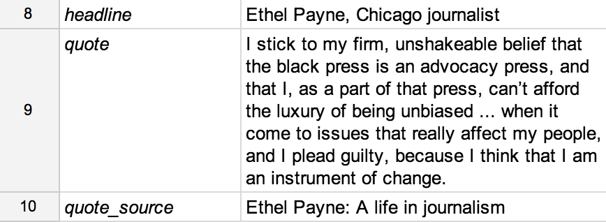

================
Tutorial
================

Let's build a website about celebrated Chicago journalist Ethel Payne!

You'll need to have access to a command prompt (an application on your computer
that allows you to execute text-based commands). On a Mac, search for the Terminal application.
On a PC, search for the Command Prompt program. All of the commands we'll show you here
will need to be typed into the command prompt.

First you need to `install <install.html>`_ and `configure <install.html#configure-tarbell-with-tarbell-configure>`_
Tarbell. (Make sure to set up a Google spreadsheet.) Go ahead. We'll wait.

Set up a new project
==============

After you've got Tarbell configured, create a new project by typing this command into your prompt::

  tarbell newproject

You'll need to answer a few questions. It will go something like this::

  tarbell newproject

  What is the project's short directory name? (e.g. my_project) ethelpayne

  Where would you like to create this project? [/Users/davideads/tarbell/ethelpayne] 

  What is the project's full title? (e.g. My awesome project) Ethel Payne: A life in journalism

  Pick a template

    [1] Basic Bootstrap 3 template
        https://github.com/newsapps/tarbell-template

    [2] Searchable map template   
        https://github.com/eads/tarbell-map-template

  Which template would you like to use? [1] 1

  Cloning into '_base'...

  Checking connectivity... done

  client_secrets found. Would you like to create a Google spreadsheet? [Y/n] y

  What Google account should have access to this this spreadsheet? (Use a full email address, such as your.name@gmail.com or the Google account equivalent.)

  Success! View the spreadsheet at https://docs.google.com/spreadsheet/your_key_will_go_here

  Copying configuration file

  - Creating tarbell.py project configuration file

  - Done copying configuration file

  Copying html files...
  Copying index.html to /Users/davideads/tarbell/ethelpayne

  Initial commit

  [master (root-commit) 2bf96fb] Created ethelpayne from https://github.com/newsapps/tarbell-template
  5 files changed, 58 insertions(+)
  create mode 100644 .gitignore
  create mode 100644 .gitmodules
  create mode 160000 _base
  create mode 100644 index.html
  create mode 100644 tarbell_config.py

  -- Calling newproject hooks --
  --- Calling create_repo
  Want to create a Github repo for this project [Y/n]? n
  Not creating Github repo...

  All done! To preview your new project, type:

  tarbell switch ethelpayne

  or

  cd /Users/davideads/tarbell/ethelpayne
  tarbell serve

  You got this!

Well, you heard the machine, you got this. Run the switch command to fire up a preview server::

  tarbell switch ethelpayne

::

  Switching to ethelpayne
  Edit this project's templates at /Users/davideads/tarbell/ethelpayne
  Running preview server...

  Press ctrl-c to stop the server
   * Running on http://127.0.0.1:5000/
   * Restarting with reloader

Now visit http://127.0.0.1:5000/ in a browser.

(You can also run your project by changing to the directory you created for it and running tarbell serve.)

You're ready to start editing your template.

Add content
===========

In a browser, open the Google spreadsheet that you created during the project set up.
This is where our website's content will live. You'll see three worksheets: *values*,
*data* and *keyed_data*. Let's look at the values worksheet first.
You should see something like this:

Keys and values are a common idea in programming: each key is shorthand for a corresponding value.
Each of the values in the *values* column is available to your site when you use
the matching *key* in your template.

.. note::
Header fields that start with underscores, like *_notes* does here, will not be made
available to your template.

Open your project's index.html page and find this line::

    <h1>{{ headline }}</h1>

.. note::

To start creating pages, you'll need a text editor. (`Notepad++<http://notepad-plus-plus.org/download/v6.6.1.html>`_ is a
good starter editor for Windows, while `TextWrangler<http://www.barebones.com/products/textwrangler/>`_ is a
good one for Macs.)

Look at your page in the browser again and notice the headline matches what's
in your Google spreadsheet under the *value* column with the *key* "headline".
Try changing that value in the spreadsheet to "Ethel Payne, Chicago journalist".

Reload the server at http://127.0.0.1:5000 in your web browser to see your changes!

You can add as many keys and values as you like. We'll add a few.

Now we need to reference these variables in the template. Go back to index.html and add::

  <blockquote>{{ quote }}</blockquote>
  
from {{ quote_source }}

Reload your site and look at the results!

.. note::

  Tarbell uses `Jinja2<http://jinja.pocoo.org/>`_ for templating. Read the `excellent documentation<http://jinja.pocoo.org/docs/>`_ to learn more about using Jinja.

Displaying data
===============

Sometimes you need to display tabular data. Helpfully, the Google spreadsheet you
created has some data like this under the *data* worksheet. The best way to display
this data in Tarbell is by using a for loop (using `Jinja2<http://jinja.pocoo.org/>`_ syntax)::

  
    

      <strong>{{ row.column1 }}:</strong>
      {{ row.column2 }}
    

  

You should see the following when you reload your page:

**row1, column1**:	row1, column2
**row2, column1**:	row2, column2

Let's take a closer look at what's going on here::

  

This reads in every row in the *data* worksheet. If we called our worksheet "birthdates,"
we could access that data by doing::

  

You'll notice that we no longer have columns labeled "key" and "value." Instead, we access
the column we want by name. To understand this better, let's add some data about some
famous ladies who might have been friends of Ida Tarbell had they known one another:

.. image:: addtl_columns.png

Now let's edit our index.html again to display this information::

  
    <h2>{{ row.name }}</h2>
    <strong>{{ row.born|format_date }} - {{ row.died|format_date }}</strong>
    
{{ row.name }} was known for her work in {{ row.known_for }}.

  

Your page should now look like this:

.. image:: tabular_data.png

Adding CSS
==========

Out of the box, Tarbell gives you Bootstrap 3 CSS. Chances are, you'll want to extend
this to add your own CSS to your project.

To this point, we've ignored the *_base* directory in your project. Now's the time to
dive in! You may have noticed this line up at the top of your index.html file::

  

The _base.html file is where all of the CSS, JavaScript and other goodies live. By "extending"
_base.html, index.html has access to all of the things that live in the base. You can
`read more about how template inheritance works here.<http://jinja.pocoo.org/docs/templates/#template-inheritance>`_

.. note::

  Filenames prefaced with an underscore will be ignored when you publish your project. Our naming convention
  is to use underscores for "partial" templates that represent small pieces of the page, like navigation
  and footers.

There are two CSS blocks at the top of the page::

  
  <link rel="stylesheet" type="text/css" href="http://cdnjs.cloudflare.com/ajax/libs/twitter-bootstrap/3.1.1/css/bootstrap.min.css" />
  <link rel="stylesheet" type="text/css" href="css/base.css" />
  

  

The first block includes Bootstrap 3's CSS and your project's default base.css stylesheet. Don't worry about
it right now. The second block is what you'll want to extend.

.. note::

  You'll only need to touch the library_css block if you need to do something like override the version of Bootstrap
  included here. Otherwise, for adding project-wide styles, edit the base.css file.

In your project root (i.e., not in base), create a css folder. Inside that, create a new style.css file and
add some CSS rules::

  h2 { font-family: Georgia, serif; }
  strong { color: #c7254e; }

Now switch back over to your index.html and add the css block. Do this on line 2, after the base extension::

  

  
  <link rel="stylesheet" href="css/style.css">
  

  

Your text should now be styled!

Using Javascript
===============

You can include JavaScript on your page much the way you would include CSS. By default,
these are the blocks available in _base.html::

  
  
  
  

  

The *library_scripts* block contains the default Bootstrap Javascript and jQuery. You probably
don't need to mess with this.

The *scripts* block can be extended in your templates. You'll want to create a *js* directory in
your project root to hold all of your Javascript files. Then you can include them in your index.html
(or other templates)::
  
  
  

Overriding default templates
============================

While the Tarbell blueprint contains some very handy things in the _base directory,
you may find you need to override some of the provided templates. One of the most common
case in which this occurs is the navigation.

In the _base.html template, you can see that the nav is included just before the content starts::

  
    
  

  

To override the default nav, create a new _nav.html file in your project root (at the same
level as index.html, not within the _base directory). Type in a message to yourself::

  Ida Tarbell would be proud of this website!

Reload your test page. Bingo!

Now, such a message probably isn't very helpful to your users, so to create a more functional
nav, copy the code out of _base/_nav.html, paste it into _nav.html,
and rejigger the code as desired. It's all Bootstrap 3, so you might find it helpful to
`view the Bootstrap navbar docs.<http://getbootstrap.com/components/#navbar>`_

Putting it all together: Leaflet maps
====================================

Let's set up a simple Leaflet map. Inside the content block, add a div that will contain your map::

    

We'll need to set a height for this map with CSS, so let's create a stylesheet (by creating
a css folder in the project root and making a styles.css file) and add that rule::

  #map { height: 180px; }

Include the Leaflet CSS and your new stylesheet before the content block::

  
  <link rel="stylesheet" href="http://cdn.leafletjs.com/leaflet-0.7.2/leaflet.css" />
  <link rel="stylesheet" href="css/styles.css" />
  

Then add the Javascript library after the content block::

  
  
  

